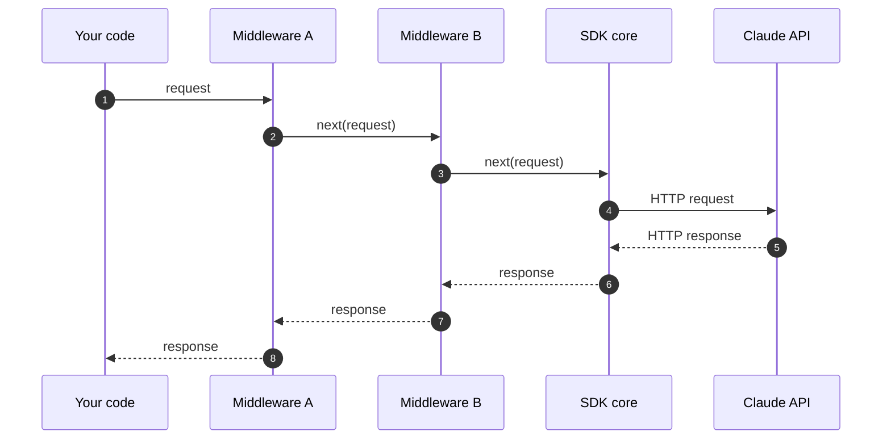

# SDK middleware

Intercept and modify requests and responses in the Anthropic SDKs.

---

The Anthropic SDKs provide a middleware (or interceptor) hook that lets you run code before a request is sent and after the response is received. Use middleware for cross-cutting concerns such as logging, custom retries, request annotation, and refusal fallback handling.



Each middleware can inspect or replace the request before calling `next()`, and the response after `next()` returns.

## Registering middleware

Each middleware is a function that receives the outgoing request and a `next` callable. Call `next` to forward the request to the rest of the chain (or directly to the SDK core if this is the last middleware), and return its response. Anything before the `next` call runs on the way out; anything after runs on the way back.

<Tabs>

<Tab title="Python">

```python hidelines={1..2}
from anthropic import Anthropic, APIRequest, CallNext


def logging_middleware(request: APIRequest, call_next: CallNext):
    # Before the request
    print(f"-> {request.method} {request.url}")

    # Forward the request to the rest of the chain
    response = call_next(request)

    # After the request
    print(f"<- {response.status_code}")

    return response


client = Anthropic(middleware=[logging_middleware])
```

</Tab>

<Tab title="TypeScript">

```typescript
import Anthropic, { type Middleware } from "@anthropic-ai/sdk";

const loggingMiddleware: Middleware = async (request, next, ctx) => {
  // Before the request
  ctx.logger.debug("->", request.method, request.url);

  // Forward the request to the rest of the chain
  const response = await next(request);

  // After the request
  ctx.logger.debug("<-", response.status, request.url);

  return response;
};

const client = new Anthropic({ middleware: [loggingMiddleware] });
```

</Tab>

<Tab title="Go">

```go hidelines={1..16,32..33}
package main

import (
	"net/http"
	"time"

	"github.com/anthropics/anthropic-sdk-go"
	"github.com/anthropics/anthropic-sdk-go/option"
)

var _ = anthropic.ModelClaudeOpus4_8

func LogReq(req *http.Request)                              {}
func LogRes(res *http.Response, err error, d time.Duration) {}

func main() {
	client := anthropic.NewClient(
		option.WithMiddleware(func(req *http.Request, next option.MiddlewareNext) (res *http.Response, err error) {
			// Before the request
			start := time.Now()
			LogReq(req)

			// Forward the request to the next handler
			res, err = next(req)

			// Handle stuff after the request
			LogRes(res, err, time.Since(start))

			return res, err
		}),
	)
	_ = client
}
```

</Tab>

<Tab title="Java">

```java hidelines={1..6,22}
import com.anthropic.client.AnthropicClient;
import com.anthropic.client.okhttp.AnthropicOkHttpClient;
import com.anthropic.core.http.HttpResponse;
import com.anthropic.core.http.Interceptor;

void main() {
    AnthropicClient client = AnthropicOkHttpClient.builder()
        .fromEnv()
        .addInterceptor(Interceptor.syncOnly((nextClient, request, requestOptions) -> {
            // Before the request
            IO.println(request.method() + " /" + String.join("/", request.pathSegments()));

            // Forward the request to the next handler
            HttpResponse response = nextClient.execute(request, requestOptions);

            // After the request
            IO.println(response.statusCode());

            return response;
        }))
        .build();
}
```

</Tab>

<Tab title="C#">

```csharp hidelines={1..2}
using System;
using Anthropic;
using Anthropic.Core;

AnthropicClient client = new()
{
    Handlers =
    [
        Handler.Create(async (request, next, cancellationToken) =>
        {
            // Before the request
            Console.WriteLine($"Sending {request.Method} {request.RequestUri}");

            // Forward the request to the next handler
            var response = await next(request, cancellationToken);

            // Handle stuff after the request
            Console.WriteLine($"Received {(int)response.StatusCode}");

            return response;
        }),
    ],
};
```

</Tab>

<Tab title="Ruby">

<Note>
Middleware is not currently available in the Ruby SDK.
</Note>

</Tab>

<Tab title="PHP">

<Note>
Middleware is not currently available in the PHP SDK.
</Note>

</Tab>

</Tabs>

## Middleware ordering

When you register multiple middleware, they apply in the order given: the first middleware's "before" code runs first, and its "after" code runs last. Middleware registered on the client runs before middleware passed as a per-request option.

In the Go SDK, repeated `option.WithMiddleware` calls concatenate (client first, then method). In the other SDKs, pass an array; later entries wrap inner.

## Replacing the HTTP client

Each SDK also accepts a custom HTTP client (for proxy configuration, custom TLS, or connection pooling). Only one HTTP client is used per SDK client; setting it replaces the default. The custom HTTP client receives requests after all middleware has run.

## Built-in middleware

The SDKs ship a refusal-fallback middleware that automatically retries requests Claude Fable 5 declines on a fallback model. See [Detect and retry on a fallback model](/docs/en/build-with-claude/refusals-and-fallback#client-side-fallback) for setup and per-language examples.